<div align="center">
  <h3><code>aakash@github ~ $ whoami</code></h3>
  <table>
    <tr>
      <td valign="top"></td>
      <td valign="top"></td>
    </tr>
  </table>

  <br><br>

  <h3><code>aakash@github ~ $ ./contributions.sh</code></h3>
  

  <br><br>

  <h3><code>aakash@github ~ $ ./links.sh</code></h3>
  <p>
    <a href="https://www.linkedin.com/in/aakashbuddhakannan/"></a>&nbsp;
    <a href="https://www.instagram.com/"></a>&nbsp;
    <a href="https://github.com/Aakashxnoir"></a>
  </p>
</div>

<br/>

<div align="center">
  <h3><code>aakash@github ~ $ cat ~/.config/stack.cfg</code></h3>
</div>

<p align="center">
  
  
  
  
  
  
  
</p>

<br/>

<div align="center">
  <h3><code>aakash@github ~ $ cat /etc/motd</code></h3>
</div>

```text
╔══════════════════════════════════════════════════════════╗
║  ▸  Building full-stack productivity systems             ║
║  ▸  Crafting multilingual & accessible web apps          ║
║  ▸  Turning ideas into shipped products                  ║
║  ▸  Clean code, darker aesthetics                        ║
╚══════════════════════════════════════════════════════════╝
```

<br/>

<div align="center">
  <h3><code>aakash@github ~ $ ls -la ./projects/</code></h3>
</div>

| Project | Description | Stack | Type |
|---|---|:---:|:---:|
| 🌿 [life-tracker](https://github.com/Aakashxnoir/life-tracker) | Personal habit & focus tracker — React, Vite, Tailwind, Firebase (auth, Firestore, storage) |  | Full-Stack |
| 🤝 [NBOS-Skill-swap](https://github.com/Aakashxnoir/NBOS-Skill-swap-) | Platform where people can share or swap skills with each other |  | Web App |
| 🔍 [Geeks-for-Geeks](https://github.com/Aakashxnoir/Geeks-for-Geeks-) | DSA practice & problem-solving repo |  | Practice |
| 🎮 [Naruto-Dodge-Game](https://github.com/Aakashxnoir/Naruto-Dodge-Game-) | Simple arcade-style dodge game |  | Game |
| 🔒 [Landroid_Analysis_App](https://github.com/Aakashxnoir/Landroid_Analysis-App) | Analysis tool for Android-related data |  | Private |
| 🌐 [College-Productivity-OS](https://github.com/Aakashxnoir/College-Productivity-OS-) | All-in-one productivity system for college life |  | Full-Stack |
| ✅ [Smart-To-Do-app](https://github.com/Aakashxnoir/Smart-To-Do-app-) | Task manager with smart prioritization |  | Productivity |
| 📚 [Student-Library-Management](https://github.com/Aakashxnoir/Student-Library-management-) | Library catalog & lending system |  | Full-Stack |
| 🌍 [Sevagan-Multilingual-Service-app](https://github.com/Aakashxnoir/Sevagan---Multilingual-Service-app) | Multilingual public service access app |  | Web App |
| 🎌 [Anime-Gallery](https://github.com/Aakashxnoir/Anime-Gallery) | Browsable anime image gallery |  | Fun |
| 💬 [Quote-Generator](https://github.com/Aakashxnoir/Quote-Generator) | Random quote generator utility |  | Tool |

> 📌 Pinned on profile: `life-tracker` · `NBOS-Skill-swap` · `Geeks-for-Geeks` · `Naruto-Dodge-Game`

<br/>

<div align="center">
  <h3><code>aakash@github ~ $ ping -c 1 aakashxnoir</code></h3>
</div>

<p align="center">
  <a href="https://github.com/Aakashxnoir"></a>
  <a href="https://www.linkedin.com/in/aakashbuddhakannan/"></a>
  <a href="https://www.instagram.com/"></a>
</p>

<p align="center">
  
</p>
